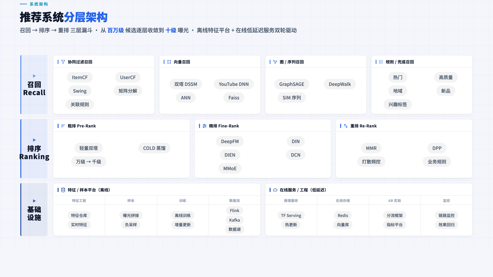
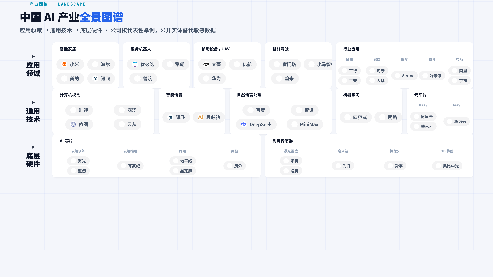

# ppt-report-generator

**English** | [中文](#中文)

> Turn data reports into 16:9 web-based slide decks — a Claude Code skill / standalone project template.
> **One file per slide · physical data separation · ECharts · 5 themes · one-click PDF export**

[](LICENSE)
[](https://docs.claude.com/en/docs/claude-code/skills)

## Preview

**Recommender-system layered architecture** (`landscape-map` template, no ECharts — pure CSS structure graph):



**Industry landscape map** (3-tier nested + logo wall; public entities replace sensitive data):



## What is this

A template that engineers the "data report → web slide deck" workflow. **Two ways to use it:**

1. **As a Claude Code Skill** — drop this repo into `~/.claude/skills/ppt-report-generator/` and let Claude build reports following this spec automatically
2. **As a standalone project template** — copy `assets/` to `src/` and run `python3 build.py` to bundle a single HTML

## What problem it solves

Slide tools (Keynote / Lark Docs / Google Slides) have a few chronic pain points for data reporting:

- ❌ Change one number → redraw the whole chart → half an hour gone
- ❌ Inconsistent font sizes across slides, misaligned cards, messy palette
- ❌ Want a different style? Redo every slide one by one
- ❌ Want Claude / GPT to fix one slide? You have to send the whole file — token explosion

`ppt-report-generator` solves this with an engineering approach:

- ✅ **One slide = 3 small files** (HTML + CSS + JS); changing a slide touches only 3 files of ≤ 200 lines each
- ✅ **Data in Excel / CSV** (JSON also supported); build auto-converts to JSON and injects it — next update only edits Excel, rendering code stays untouched
- ✅ **5 preset themes**, switch with one click in the top-right corner — Business Navy / Tech Dark / Warm Business / Light Minimal / Minimal Mono
- ✅ **ECharts charts + data-shape decision table**, tells you which chart fits which data (refuses pie charts with 5+ slices)
- ✅ **8 font-size levels / 4 font weights / the "Golden 11" core principles** — strict card-boundary alignment, no more "looks messy"
- ✅ **One-click PDF export** (playwright + img2pdf, 13.33×7.5 inch 16:9 standard)

## What the repo provides

- **6 page templates** (`assets/slides-templates/`):
  - `kpi-overview` — multi-section × multi-card overview
  - `two-country` — two-subject side-by-side comparison (KPI + metric table)
  - `three-phase` — three-phase timeline + multiple charts
  - `multi-trend` — multi-subject trend comparison
  - `supply-bars` — categorical bars + trend lines
  - `landscape-map` — **NEW** industry/competitor landscape (12-grid 3-tier nested + logo wall; pure CSS, no ECharts; public entities replace sensitive data)
- **5 preset themes**: modern-light / dark-tech / warm-business / brand-blue / minimal-mono (one-click switch top-right, persisted via localStorage)
- **6 reference docs** (`references/`, ~1300 lines): architecture · design system · layout principles · chart selection · components · themes
- **Build scripts**: `build.py` (bundle HTML) + `export_pdf.py` (export PDF) + `quickstart.sh` (one-click init for a new project)

## 5-minute quickstart (standalone project mode)

```bash
# 1. Clone the repo
git clone https://github.com/<your-username>/ppt-report-generator.git
cd ppt-report-generator

# 2. One-click init a new project
./quickstart.sh ../my-report

# 3. Enter the project and start editing
cd ../my-report
# Edit src/slides/slide-1.html / src/data/slide-1.json ...
python3 build.py
open *.html       # Open in browser, ← / → to navigate

# 4. (Optional) Export PDF
pip install playwright img2pdf
playwright install chromium
python3 export_pdf.py
```

## Using it as a Claude Code Skill

```bash
# macOS / Linux
mkdir -p ~/.claude/skills
git clone https://github.com/<your-username>/ppt-report-generator.git ~/.claude/skills/ppt-report-generator
```

Then in Claude Code just say **"make a monthly report"** / **"turn this data into a slide deck"**, and Claude will follow this skill's workflow automatically: pick a page template → organize data in `src/data/slide-N.xlsx` → lay out using the 8 font-size levels + the "Golden 11" principles → call the matching ECharts template function → output via `build.py`.

> **Language**: the skill spec and reference docs ship in two languages. The repo root (`SKILL.md`, `references/`) is Chinese; a fully English version lives in [`i18n/en/`](i18n/en/) (`i18n/en/SKILL.md` + `i18n/en/references/`, with an English trigger description). For English use, clone with that path as the skill root, e.g. point Claude Code at `i18n/en/SKILL.md`.

See [`SKILL.md`](SKILL.md) for details.

## Data format: Excel / CSV / JSON all work

Business data already lives in Excel — **don't retype it into JSON**:

```
src/data/
├── slide-1.xlsx    ← recommended — multiple sheets auto-convert to multiple JSON keys
├── slide-2.csv     ← single-table data
└── slide-3.json    ← complex nested structure / machine-generated
```

**xlsx conversion rule**: each sheet → one top-level JSON key, each row → one object (`{header: value}`). Sheets/columns starting with `_` are skipped.

Example: `slide-3.xlsx` contains sheet `kpis` (columns label/value/unit) and `trend` (columns week/na/eu); after build it's injected as:

```js
window.__DATA_3__ = {
  kpis:  [{label: 'DAU', value: 12.4, unit: '万'}, {label: 'ARR', value: 48, unit: 'M USD'}],
  trend: [{week: 'W1', na: 12.1, eu: 8.4}, {week: 'W2', na: 12.4, eu: 8.6}]
}
```

**xlsx dependency**: `pip install openpyxl` (csv / json use the standard library, no dependency). See [`references/architecture.md`](references/architecture.md).

## Repo structure

```
ppt-report-generator/
├── SKILL.md                    # Skill entry (Claude Code loads this)
├── README.md                   # The file you're reading
├── LICENSE                     # MIT
├── quickstart.sh               # One-click init for a new project
├── references/                 # Design philosophy & rules (6 docs, ~1300 lines)
│   ├── architecture.md         # Split architecture + build.py internals + adaptive scaling
│   ├── design-system.md        # 8 font-size levels / weights / colors / spacing hard rules
│   ├── layout-principles.md    # 14 classic slide layout rules (incl. card-boundary alignment)
│   ├── chart-mapping.md        # Data shape ↔ chart selection decision table + ECharts config templates
│   ├── components.md           # Common component library (KPI / Phase / Mini-bar etc.)
│   └── themes.md               # 5 preset themes + customization
└── assets/                     # Ready-to-copy production files
    ├── shell.html              # HTML skeleton (placeholders)
    ├── build.py                # Bundle script (auto-detects N slides + xlsx/csv/json data)
    ├── export_pdf.py           # PDF export
    ├── xlsx2json.py            # Excel/CSV → JSON converter (called by build, also runs standalone)
    ├── styles/
    │   ├── common.css          # 5 theme variables + adaptive scaling
    │   └── components.css      # Common components
    ├── scripts/
    │   ├── common.js           # Adaptive + navigation + 4 ECharts template functions
    │   └── theme-switcher.js   # Theme switching
    └── slides-templates/       # 5 page templates (copy → rename slide-N.html)
        ├── kpi-overview.html       # Multi-section × multi-card overview
        ├── two-country.html        # Two-subject side-by-side comparison
        ├── three-phase.html        # Three-phase timeline + multiple charts
        ├── multi-trend.html        # Multi-subject trend comparison
        └── supply-bars.html        # Categorical bars + trend lines
```

> The data directory `src/data/` is created per-project by `quickstart.sh` at init time; no sample data is preset.

## Core philosophy (the "Golden 11")

1. Don't hardcode data in rendering code → put it in `data/slide-N.json`
2. Don't let a single slide's HTML exceed 200 lines
3. Use only the 8 font-size levels `var(--fs-*)`; don't add new sizes ad hoc
4. No pie charts for 5+ items (use 100% stacked bars)
5. Don't hardcode colors → use `var(--accent*)` theme variables
6. Every slide must have the label / title / subtitle trio; subtitle contains the key number
7. The design canvas is fixed at 1600×900; don't use vw/vh
8. Always edit `src/`, never the build output
9. Each slide answers one question and has one visual anchor
10. The whole deck needs rhythm (alternating high/low density)
11. **Card boundaries must be strictly aligned**: grid `1fr 1fr` + `flex:1 1 0; min-height:0` + flexible spacer to absorb differences; never hardcode height

See [`references/`](references/) for details.

## Use cases

- ✅ Monthly / quarterly business reports
- ✅ Internal / external decks for data teams
- ✅ Project proposals, project retrospectives
- ✅ Scenarios with many "comparison experiments / multi-subject trends / KPI overview" charts
- ⚠️ Less suitable for: text-heavy decks (see the docx skill), talks needing complex animation (see PowerPoint)

## Compatibility

- Browsers: Chrome / Safari / Edge / Firefox (any modern version)
- Python: 3.8+ (only build.py needs it, no external deps; export_pdf.py needs playwright + img2pdf)
- ECharts: 5.5.x (loaded via CDN)
- Claude Code: required only when used as a skill

## License

[MIT](LICENSE) — use, modify, and distribute freely.

## Acknowledgements

Every rule grew out of a pitfall hit while making real reports.

## Feedback & contributing

Issues / PRs welcome:

- Submit new page templates (with screenshots)
- Add new theme presets
- Fix a layout rule
- Translate the docs

See [CONTRIBUTING.md](CONTRIBUTING.md).

---

<a name="中文"></a>

# ppt-report-generator（中文）

[English](#ppt-report-generator) | **中文**

> 把数据汇报做成 16:9 网页版 PPT 的 Claude Code skill / 独立工程模板。
> **每页一个文件 · 数据物理分离 · ECharts · 5 套主题 · 一键导出 PDF**

## 效果预览

**推荐系统分层架构**（`landscape-map` 模板，纯 CSS 结构图，不依赖 ECharts）：


**产业图谱全景**（3-tier 嵌套 + logo 墙；用公开实体替代敏感数据）：


## 这是什么

一套把"数据汇报 → 网页 PPT"工程化的模板。**两种用法**：

1. **作为 Claude Code Skill 使用** — 把这个仓库放到 `~/.claude/skills/ppt-report-generator/`，让 Claude 自动按这套规范帮你做汇报
2. **作为独立工程模板使用** — 直接把 `assets/` 拷成 `src/`，运行 `python3 build.py` 合成单 HTML

## 它解决什么问题

PPT 工具（Keynote / 飞书文档 / Google Slides）做数据汇报有几个老大难：

- ❌ 改一个数字 → 整张图重画 → 半小时没了
- ❌ 上下页字号不一致、卡片对不齐、配色乱
- ❌ 想换风格？逐页重做
- ❌ Claude / GPT 想帮你改某一页？必须把整份发它，token 爆炸

`ppt-report-generator` 用工程化方法解决：

- ✅ **每页 = 3 个小文件**（HTML + CSS + JS），改一页只动 3 个 ≤ 200 行的小文件
- ✅ **数据用 Excel / CSV**（也支持 JSON），build 自动转 JSON 注入 — 下次更新只改 Excel，渲染代码完全不动
- ✅ **5 套预设主题**，右上角一键切换 — 商务深蓝 / 科技深色 / 暖色商业 / 浅色简约 / 极简单色
- ✅ **ECharts 图表 + 数据形态决策表**，告诉你什么数据用什么图（拒绝 5 项以上饼图）
- ✅ **8 级字号 / 4 级字重 / "黄金 11 条"核心理念** — 卡片边界严格对齐、不再"看着乱"
- ✅ **一键导 PDF**（playwright + img2pdf，13.33×7.5 inch 16:9 标准）

## 仓库提供什么

- **6 套页面模板**（`assets/slides-templates/`）：
  - `kpi-overview` — 多板块 × 多卡片总览
  - `two-country` — 双对象左右对照（KPI + metric 表）
  - `three-phase` — 三阶段时间线 + 多图表
  - `multi-trend` — 多对象趋势对比
  - `supply-bars` — 分类条形 + 趋势折线
  - `landscape-map` — **新增** 产业图谱 / 竞品全景（12 栅格 3-tier 嵌套 + logo 墙；纯 CSS，不依赖 ECharts；用公开实体替代敏感数据）
- **5 套预设主题**：modern-light / dark-tech / warm-business / brand-blue / minimal-mono（右上角一键切，localStorage 持久化）
- **6 份参考文档**（`references/`，~1300 行）：架构 · 设计系统 · 布局法则 · 图表选型 · 组件 · 主题
- **构建脚本**：`build.py`（合成 HTML）+ `export_pdf.py`（导出 PDF）+ `quickstart.sh`（一键初始化新项目）

## 5 分钟上手（独立工程模式）

```bash
# 1. 克隆仓库
git clone https://github.com/<your-username>/ppt-report-generator.git
cd ppt-report-generator

# 2. 一键初始化新项目
./quickstart.sh ../my-report

# 3. 进项目，开始改
cd ../my-report
# 编辑 src/slides/slide-1.html / src/data/slide-1.json ...
python3 build.py
open *.html       # 浏览器打开，← / → 翻页

# 4.（可选）导出 PDF
pip install playwright img2pdf
playwright install chromium
python3 export_pdf.py
```

## 作为 Claude Code Skill 使用

```bash
# macOS / Linux
mkdir -p ~/.claude/skills
git clone https://github.com/<your-username>/ppt-report-generator.git ~/.claude/skills/ppt-report-generator
```

之后在 Claude Code 里直接说**"做一份月度汇报"** / **"把这个数据做成 PPT"**，Claude 会自动按本 skill 的规范工作流走：选页面模板 → 在 `src/data/slide-N.xlsx` 整理数据 → 按 8 级字号 + "黄金 11 条"理念排版 → 调用对应 ECharts 范本函数 → `build.py` 输出。

> **语言版本**：skill 规范和参考文档提供中英两份。仓库根目录（`SKILL.md`、`references/`）为中文；完整英文版在 [`i18n/en/`](i18n/en/)（`i18n/en/SKILL.md` + `i18n/en/references/`，含英文触发 description）。英文用户把该路径作为 skill 根目录使用，即让 Claude Code 加载 `i18n/en/SKILL.md`。

详见 [`SKILL.md`](SKILL.md)。

## 数据格式：Excel / CSV / JSON 都行

日常业务数据本来就在 Excel 里，**不要再手抄到 JSON**：

```
src/data/
├── slide-1.xlsx    ← 推荐 — 多 sheet 自动转为多个 JSON key
├── slide-2.csv     ← 单表数据
└── slide-3.json    ← 复杂嵌套结构 / 机器生成
```

**xlsx 转换规则**：每个 sheet → JSON 顶层一个 key，每行 → 一个对象（`{表头: 值}`）。以 `_` 开头的 sheet/列名跳过。

举例：`slide-3.xlsx` 含 sheet `kpis`（label/value/unit 三列）和 `trend`（week/na/eu 三列），build 后注入为：

```js
window.__DATA_3__ = {
  kpis:  [{label: 'DAU', value: 12.4, unit: '万'}, {label: 'ARR', value: 48, unit: 'M USD'}],
  trend: [{week: 'W1', na: 12.1, eu: 8.4}, {week: 'W2', na: 12.4, eu: 8.6}]
}
```

**xlsx 依赖**：`pip install openpyxl`（csv / json 用标准库，无依赖）。详见 [`references/architecture.md`](references/architecture.md)。

## 仓库结构

```
ppt-report-generator/
├── SKILL.md                    # Skill 入口（Claude Code 加载这个）
├── README.md                   # 你正在看的文件
├── LICENSE                     # MIT
├── quickstart.sh               # 一键初始化新项目
├── references/                 # 设计哲学与规则（共 6 份 ~1300 行）
│   ├── architecture.md         # 拆分架构 + build.py 工作原理 + 自适应缩放
│   ├── design-system.md        # 8 级字号 / 字重 / 颜色 / 间距硬规则
│   ├── layout-principles.md    # 14 条经典 PPT 布局法则（含卡片边界对齐）
│   ├── chart-mapping.md        # 数据形态 ↔ 图表选型决策表 + ECharts 配置范本
│   ├── components.md           # 通用组件库（KPI / Phase / Mini-bar 等）
│   └── themes.md               # 5 套预设主题 + 自定义方法
└── assets/                     # 可直接拷贝的成品文件
    ├── shell.html              # HTML 骨架（占位符）
    ├── build.py                # 合成脚本（自动检测 N 个 slides + xlsx/csv/json 数据）
    ├── export_pdf.py           # PDF 导出
    ├── xlsx2json.py            # Excel/CSV → JSON 转换器（被 build 调用，也可单跑）
    ├── styles/
    │   ├── common.css          # 5 套主题变量 + 自适应缩放
    │   └── components.css      # 通用组件
    ├── scripts/
    │   ├── common.js           # 自适应 + 导航 + 4 个 ECharts 范本函数
    │   └── theme-switcher.js   # 主题切换
    └── slides-templates/       # 5 套页面模板（拷贝 → 改名 slide-N.html）
        ├── kpi-overview.html       # 多板块 × 多卡片总览
        ├── two-country.html        # 双对象左右对照
        ├── three-phase.html        # 三阶段时间线 + 多图
        ├── multi-trend.html        # 多对象趋势对比
        └── supply-bars.html        # 分类条形 + 趋势折线
```

> 数据目录 `src/data/` 由 `quickstart.sh` 在初始化时为新项目创建，不预置示例数据。

## 核心理念（"黄金 11 条"）

1. 不要把数据写死在渲染代码里 → 进 `data/slide-N.json`
2. 不要让一页 HTML 超过 200 行
3. 字号只用 8 级 `var(--fs-*)`，不要随手加新字号
4. 5 项以上不用饼图（用 100% 堆叠条形）
5. 不要硬编码颜色 → 用 `var(--accent*)` 主题变量
6. 每页必有 label / title / subtitle 三件套，subtitle 含关键数字
7. 设计稿固定 1600×900，不要用 vw/vh
8. 永远改 `src/`，不要改 build 产物
9. 每页只回答一个问题，只有一个视觉锚点
10. 整份 deck 要有节奏（高/低密度交替）
11. **卡片边界必须严格对齐**：grid `1fr 1fr` + `flex:1 1 0; min-height:0` + 弹性占位补差，不写死 height

详见 [`references/`](references/)。

## 使用场景

- ✅ 月度 / 季度业务汇报
- ✅ 数据团队对内 / 对外 deck
- ✅ 立项汇报、项目复盘
- ✅ 有大量"对照实验 / 多对象趋势 / KPI 总览"图表的场景
- ⚠️ 不太适合：纯文字密集 deck（去看 docx skill）、需要复杂动画的演讲（去看 PowerPoint）

## 兼容性

- 浏览器：Chrome / Safari / Edge / Firefox（任意现代版本）
- Python：3.8+（仅 build.py 需要，无外部依赖；export_pdf.py 需要 playwright + img2pdf）
- ECharts：5.5.x（CDN 引入）
- Claude Code：作为 skill 使用需 Claude Code CLI

## License

[MIT](LICENSE) — 随意使用、修改、分发。

## 致谢

每一条规则都从做汇报踩过的坑里长出来。

## 反馈与贡献

欢迎 issue / PR：

- 提交新的页面模板（带截图）
- 增加新主题预设
- 修正某条布局规则
- 翻译文档（目前主要是中文）

详见 [CONTRIBUTING.md](CONTRIBUTING.md)。
